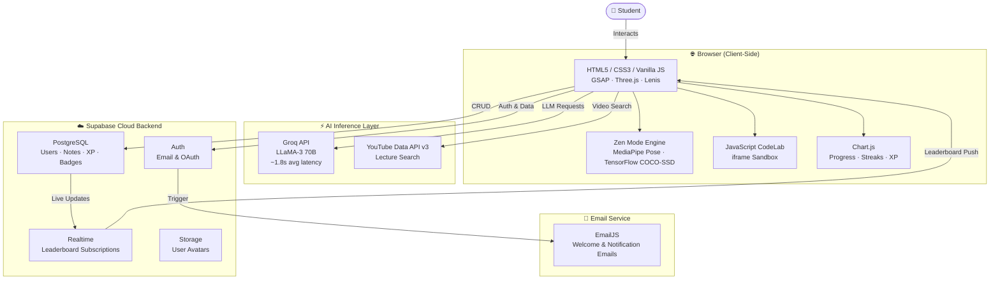

<div align="center">

<!-- Animated Banner -->
<a href="#">
  
</a>

<!-- Typing SVG -->
<a href="#">
  
</a>

<br/>

<!-- Mission Statement -->
<p align="center">
  <em>SAGE transforms passive study into an <strong>intelligent, adaptive, gamified experience</strong> — combining cutting-edge computer vision, ultra-fast LLM inference, and real-time analytics into one seamless dashboard.</em>
</p>

<br/>

<!-- Badges Row 1 -->
<p align="center">
  
  
  
  
</p>

<!-- Badges Row 2 -->
<p align="center">
  
  
  
  
</p>

<!-- Navigation -->
<p align="center">
  <a href="#-what-is-sage">About</a> •
  <a href="#-core-features">Features</a> •
  <a href="#%EF%B8%8F-system-architecture">Architecture</a> •
  <a href="#-tech-stack">Tech Stack</a> •
  <a href="#-quick-start">Installation</a> •
  <a href="#-api-configuration">API Setup</a> •
  <a href="#%EF%B8%8F-project-structure">Structure</a> •
  <a href="#-roadmap">Roadmap</a> •
  <a href="#-author">Author</a>
</p>

</div>

---

## 🌟 What is SAGE?

> **SAGE** (Smart Adaptive Guided Education) is not just another productivity app. It is a **full-stack, AI-first learning operating system** built entirely on vanilla web technologies — no heavy frameworks, no runtime dependencies — yet powered by the most advanced AI APIs available today.

The core philosophy: **your study environment should be as intelligent as the content you are learning.** SAGE achieves this through three interlocking pillars:

| Pillar | What it does |
|--------|-------------|
| 🧠 **Cognitive AI** | Groq + LLaMA 3 for instant summarization, quiz generation, and tutoring |
| 👁️ **Perceptual AI** | TensorFlow.js + MediaPipe for real-time posture and distraction detection |
| 🎮 **Behavioral AI** | Gamification engine tracking streaks, XP, and leaderboard rankings |

---

## ✨ Core Features

<details open>
<summary><h3>🤖 1. AI-Powered Smart Video Hub</h3></summary>

The Video Hub transforms passive YouTube watching into an **active, AI-annotated learning session**.

- **🔍 Dynamic Search** — Type any subject (e.g., *"Fourier Transform"*, *"Organic Chemistry Mechanisms"*) and SAGE queries the **YouTube Data API v3** to surface the highest-quality educational lectures ranked by relevance and view count.
- **⚡ Live Summarization** — As the video plays, SAGE streams structured summaries via **Groq's LPU-powered LLaMA 3 inference** — returning key concepts, bullet-point takeaways, and suggested follow-up questions in under 2 seconds.
- **📝 Smart Note Saving** — One click pushes the AI-generated summary directly to your **Supabase PostgreSQL notes table**, tagged with the video title, timestamp, and subject category.
- **🔗 Contextual Linking** — SAGE automatically cross-references your saved notes to suggest related videos and flashcards you've created before.

</details>

<details>
<summary><h3>🧘 2. Zen Mode — Focus & Posture AI</h3></summary>

Zen Mode is SAGE's most technically ambitious feature: **real-time computer vision that runs entirely in your browser**, with zero data ever leaving your device.

#### 🎯 How It Works

```
[Webcam Feed]
      │
      ▼
[MediaPipe Pose Estimation]          [COCO-SSD Object Detection]
  → 33 landmark skeleton points       → Identifies 80 object categories
  → Shoulder-to-neck angle ratio       → Flags: "cell phone", "book"
      │                                       │
      ▼                                       ▼
[Posture Score 0–100]               [Distraction Alert]
  → Good / Warning / Critical          → ⚠️ "Phone detected!"
      │                                       │
      └──────────────┬────────────────────────┘
                     ▼
            [Focus Session Dashboard]
             → Live timer, XP earned
             → Posture history graph
             → Distraction count log
```

#### 🔬 Technical Details
- **Skeletal Mapping**: MediaPipe's `Pose` solution identifies 33 body landmarks at **30 FPS** in the browser using WebGL acceleration.
- **Posture Algorithm**: Calculates the angle between `LEFT_SHOULDER → LEFT_EAR → nose` and `RIGHT_SHOULDER → RIGHT_EAR → nose`. If the average angle drops below a configurable threshold (default: 160°), a posture warning fires.
- **Object Detection**: COCO-SSD model (quantized, ~5MB) runs asynchronously on every 10th frame to conserve CPU — optimized to specifically flag `cell phone` class objects.
- **Privacy First**: All inference is done client-side via WebGL. No video data is ever uploaded, stored, or transmitted.

#### ⚙️ Zen Mode Settings
| Setting | Default | Description |
|---------|---------|-------------|
| Posture Sensitivity | Medium | Angle threshold for warning |
| Phone Detection | Enabled | Alerts on smartphone visibility |
| Session Duration | 25 min | Pomodoro-style focus blocks |
| Break Interval | 5 min | Short break between sessions |
| XP Multiplier | 1.5× | Bonus XP for completing Zen sessions |

</details>

<details>
<summary><h3>🎮 3. Gamification Engine & Leaderboards</h3></summary>

SAGE's gamification layer transforms academic discipline into an **addictive progression system**.

#### 🏅 XP & Level System
| Action | XP Earned |
|--------|-----------|
| Completing a Zen Mode session | +50 XP |
| Acing a quiz (5/5) | +80 XP |
| Saving an AI summary | +15 XP |
| Maintaining daily streak | +30 XP/day |
| Unlocking a new badge | +25 XP |
| First login of the day | +10 XP |

#### 🔥 Study Streaks
- Streaks are calculated using **UTC midnight boundaries** to ensure fairness across time zones.
- A **grace period of 2 hours** past midnight prevents accidental streak breaks.
- Streaks are visualized on the dashboard as a GitHub-style contribution heatmap using **Chart.js**.

#### 🏆 Achievements & Badges
| Badge | Condition |
|-------|-----------|
| 🦉 Night Owl | Study session after 11 PM |
| 🔥 On Fire | 7-day streak |
| 🧠 Big Brain | Score 100% on 5 consecutive quizzes |
| ⚡ Speed Reader | Save 10 summaries in one day |
| 🥋 Discipline | Complete 20 Zen Mode sessions |
| 🌍 Globetrotter | Rank in Top 10 on Global Leaderboard |

#### 🌐 Global Leaderboard
- Powered by **Supabase real-time subscriptions** — the leaderboard refreshes live as other users earn XP.
- Displays: Rank, Username, Total XP, Current Streak, Badges Earned.
- Filters: Weekly / Monthly / All-Time.

</details>

<details>
<summary><h3>🧠 4. Dynamic Quizzes & 3D Flashcards</h3></summary>

#### 📝 AI Quiz Generator
The quiz engine uses a **multi-step prompt chain** to ensure question quality:

1. **Topic Expansion**: The LLM first expands the user's topic into 10 sub-concepts.
2. **Question Crafting**: For each sub-concept, a question is generated with 4 plausible distractors.
3. **Difficulty Balancing**: The chain auto-selects 5 questions spanning Easy / Medium / Hard.
4. **Explanation Generation**: On answer reveal, the AI explains *why* each option is correct or incorrect.

The entire pipeline runs via **Groq's streaming API**, meaning the first question appears in under 1 second.

#### 🃏 3D Flip Flashcards
- Generated dynamically from any topic using the same Groq LLM.
- Rendered with **CSS 3D transforms** (`rotateY(180deg)`) for smooth flip animations.
- Supports **spaced repetition scheduling**: cards you mark "Hard" reappear sooner.
- Export flashcard decks as JSON for offline review.

</details>

<details>
<summary><h3>💻 5. Integrated CodeLab</h3></summary>

A full JavaScript sandbox embedded directly in the dashboard — no context-switching, no new tabs.

- **🖊️ Code Editor**: Syntax-highlighted editor with bracket matching and auto-indent.
- **▶️ Live Execution**: Runs your code in an isolated `iframe` sandbox with output captured to the Live Console.
- **📋 Template Library**: Pre-loaded with common algorithm templates (sorting, recursion, data structures).
- **🧪 Test Mode**: Define expected outputs and SAGE will auto-check your solution.
- **💡 AI Hints**: Stuck? Click "Get Hint" and the Groq LLM analyzes your code and gives a Socratic hint — never the full answer.

</details>

---

## 🏗️ System Architecture



---

## 🛠️ Tech Stack

### 🎨 Frontend

| Technology | Purpose | Why SAGE uses it |
|-----------|---------|-----------------|
| **HTML5 / CSS3** | Core structure & styling | Zero build step, maximum portability |
| **Vanilla JavaScript (ES2023)** | Application logic | Full control, no framework overhead |
| **CSS Custom Properties** | Light/Dark theming | Runtime theme switching without re-renders |
| **Glassmorphism UI** | Visual design | Premium frosted-glass aesthetic with `backdrop-filter` |
| **GSAP 3 (GreenSock)** | Animations | Industry-standard animation engine; buttery 60fps |
| **Lenis** | Smooth scrolling | Physics-based scroll feel used by top creative studios |
| **Three.js** | 3D background | Neural network particle animation in WebGL |
| **Chart.js** | Data visualization | Animated progress, streak heatmaps, donut charts |
| **Lucide Icons** | Iconography | 1000+ consistent, stroke-based SVG icons |

### ☁️ Backend & Auth

| Technology | Purpose | Details |
|-----------|---------|---------|
| **Supabase** | BaaS (Backend as a Service) | PostgreSQL + Auth + Realtime + Storage |
| **Supabase Auth** | User management | Email/password + Google OAuth |
| **Supabase Realtime** | Live leaderboard | WebSocket-based row-level subscriptions |
| **EmailJS** | Transactional email | Welcome emails, streak reminders, badge notifications |

### 🤖 Artificial Intelligence

| Technology | Model / Version | Use Case |
|-----------|----------------|---------|
| **Groq API** | LLaMA-3 70B Instruct | Video summarization, quiz generation, AI tutor, flashcards |
| **TensorFlow.js** | COCO-SSD (quantized) | Browser-based smartphone detection in Zen Mode |
| **MediaPipe** | Pose Landmarker v2 | 33-point skeletal tracking for posture analysis |
| **YouTube Data API v3** | — | Educational video search and metadata retrieval |

---

## 🚀 Quick Start

> ⚠️ **Important**: SAGE **must** be served over HTTP(S) — not opened as a local file — because browsers block camera access and cross-origin API requests on the `file:///` protocol.

### Prerequisites

- [VS Code](https://code.visualstudio.com/) with the [Live Server](https://marketplace.visualstudio.com/items?itemName=ritwickdey.LiveServer) extension, **or**
- Any local HTTP server (Python, Node.js, etc.)

### Step 1: Clone the Repository

```bash
git clone https://github.com/yourusername/sage-learning-ecosystem.git
cd sage-learning-ecosystem
```

### Step 2: Set Up Environment Variables

Create a `config.js` file in the root directory (this file is `.gitignored`):

```javascript
// config.js — never commit this file!
const CONFIG = {
  SUPABASE_URL:       "https://your-project.supabase.co",
  SUPABASE_ANON_KEY:  "your-supabase-anon-key",
  GROQ_API_KEY:       "your-groq-api-key",
  YOUTUBE_API_KEY:    "your-youtube-data-api-key",
  EMAILJS_SERVICE_ID: "your-emailjs-service-id",
  EMAILJS_TEMPLATE_ID:"your-emailjs-template-id",
  EMAILJS_PUBLIC_KEY: "your-emailjs-public-key",
};
```

### Step 3: Launch the App

**Option A — VS Code Live Server (Recommended)**
1. Open the project folder in VS Code.
2. Right-click `index.html` → **"Open with Live Server"**.
3. SAGE opens at `http://127.0.0.1:5500`.

**Option B — Python HTTP Server**
```bash
# Python 3
python -m http.server 5500
# Open http://localhost:5500 in your browser
```

**Option C — Node.js**
```bash
npx serve .
# Open the URL shown in your terminal
```

### Step 4: First-Time Setup

1. Register a new account (check your email for the welcome message powered by EmailJS).
2. Allow camera permissions when prompted for Zen Mode.
3. Complete the onboarding walkthrough to earn your first 100 XP!

---

## 🔑 API Configuration

### Groq API
1. Sign up at [console.groq.com](https://console.groq.com) — free tier available.
2. Create an API key under **API Keys**.
3. Recommended model: `llama3-70b-8192` (best balance of speed and quality).
4. Rate limits on free tier: 30 requests/minute, 6000 tokens/minute.

### Supabase
1. Create a project at [supabase.com](https://supabase.com).
2. Run the schema migrations in `/supabase/schema.sql` via the Supabase SQL editor.
3. Copy your **Project URL** and **anon/public key** from Project Settings → API.
4. Enable **Google OAuth** under Authentication → Providers (optional).

### YouTube Data API v3
1. Go to [Google Cloud Console](https://console.cloud.google.com/).
2. Create a new project → Enable **YouTube Data API v3**.
3. Create credentials → API Key → restrict to your domain.
4. Free quota: **10,000 units/day** (a search costs 100 units).

### EmailJS
1. Sign up at [emailjs.com](https://www.emailjs.com/) — free for 200 emails/month.
2. Connect your email provider (Gmail recommended).
3. Create a template for the welcome email.
4. Copy your Service ID, Template ID, and Public Key.

---

## 🗂️ Project Structure

```
sage-learning-ecosystem/
│
├── 📄 index.html                # Landing page & auth gateway
├── 📄 dashboard.html            # Main app dashboard
├── 📄 config.js                 # API keys (gitignored)
│
├── 📁 css/
│   ├── main.css                 # Global styles, CSS variables, theming
│   ├── dashboard.css            # Dashboard layout & component styles
│   ├── glassmorphism.css        # Frosted-glass UI system
│   ├── animations.css           # Keyframe & transition library
│   └── responsive.css           # Breakpoints & mobile layout
│
├── 📁 js/
│   ├── app.js                   # App bootstrap, auth guard
│   ├── dashboard.js             # Dashboard initialization & routing
│   ├── ai/
│   │   ├── groq.js              # Groq API client & prompt templates
│   │   ├── quiz-generator.js    # Multi-step quiz prompt chain
│   │   ├── summarizer.js        # Video summarization pipeline
│   │   └── flashcard-engine.js  # Flashcard generation & SRS scheduling
│   ├── features/
│   │   ├── zen-mode.js          # Webcam, MediaPipe, TF.js orchestration
│   │   ├── posture-detector.js  # Skeletal angle calculation logic
│   │   ├── distraction.js       # COCO-SSD phone detection
│   │   ├── gamification.js      # XP, streaks, badge logic
│   │   ├── leaderboard.js       # Supabase realtime subscription
│   │   ├── video-hub.js         # YouTube API integration
│   │   └── codelab.js           # iframe sandbox & console capture
│   └── ui/
│       ├── theme.js             # Light/dark mode toggle
│       ├── animations.js        # GSAP timeline definitions
│       ├── charts.js            # Chart.js configuration
│       └── three-bg.js          # Three.js neural network background
│
├── 📁 supabase/
│   └── schema.sql               # Database schema & RLS policies
│
├── 📁 assets/
│   ├── icons/                   # Custom SVG icons
│   ├── sounds/                  # Notification audio (posture alert, XP gain)
│   └── fonts/                   # Self-hosted web fonts
│
├── 📄 .gitignore
├── 📄 LICENSE
└── 📄 README.md
```

---

## 🗺️ Roadmap

```
2025 Q1 ━━━━━━━━━━━━━━━━━━━━━━━━━━━━━━━━━━━━━━━━━━━━━ [COMPLETED]
  ✅ Core dashboard UI with glassmorphism design system
  ✅ Supabase authentication (Email + OAuth)
  ✅ Groq API integration for AI tutoring
  ✅ YouTube Video Hub with live summarization
  ✅ Zen Mode with MediaPipe posture detection

2025 Q2 ━━━━━━━━━━━━━━━━━━━━━━━━━━━━━━━━━━━━━━━━━━━━━ [IN PROGRESS]
  🔄 Gamification engine (XP, streaks, badges)
  🔄 Global leaderboard with Supabase Realtime
  🔄 3D Flashcard system with spaced repetition
  🔄 Integrated CodeLab with AI hints

2025 Q3 ━━━━━━━━━━━━━━━━━━━━━━━━━━━━━━━━━━━━━━━━━━━━━ [PLANNED]
  📋 Mobile-responsive PWA with offline flashcard access
  📋 Multi-language support (Spanish, Hindi, French, German)
  📋 AI Study Planner: Generate weekly schedules from exam dates
  📋 Collaborative Study Rooms (WebRTC + shared whiteboards)

2025 Q4 ━━━━━━━━━━━━━━━━━━━━━━━━━━━━━━━━━━━━━━━━━━━━━ [VISION]
  🔮 Adaptive Learning Paths: AI maps your knowledge gaps
  🔮 SAGE Mobile App (React Native)
  🔮 Integration with Canvas/Moodle LMS via API
  🔮 Voice-controlled AI Tutor with ElevenLabs TTS
```

---

## 🤝 Contributing

Contributions are warmly welcomed! Whether it's a bug fix, a new feature, or improving documentation — every PR makes SAGE better for every student.

```bash
# 1. Fork the repo and create your branch
git checkout -b feature/your-amazing-feature

# 2. Make your changes and commit with a descriptive message
git commit -m "feat: add spaced repetition interval calculator"

# 3. Push to your fork
git push origin feature/your-amazing-feature

# 4. Open a Pull Request on GitHub
```

Please read `CONTRIBUTING.md` for our code style guide, branch naming conventions, and PR checklist.

---

## 📄 License

This project is licensed under the **MIT License** — see the [LICENSE](LICENSE) file for details.

---

## 👤 Author

<div align="center">

<!-- Replace with your actual GitHub username -->
<a href="https://github.com/yourusername">
  
</a>

**Your Name**

[](https://github.com/yourusername)
[](https://linkedin.com/in/yourusername)
[](https://twitter.com/yourhandle)

</div>

---

<div align="center">

<!-- Animated Footer Wave -->


<br/>

<a href="#">
  
</a>

<br/>

**⭐ If SAGE helped you study smarter, give it a star — it means the world!**

</div>
